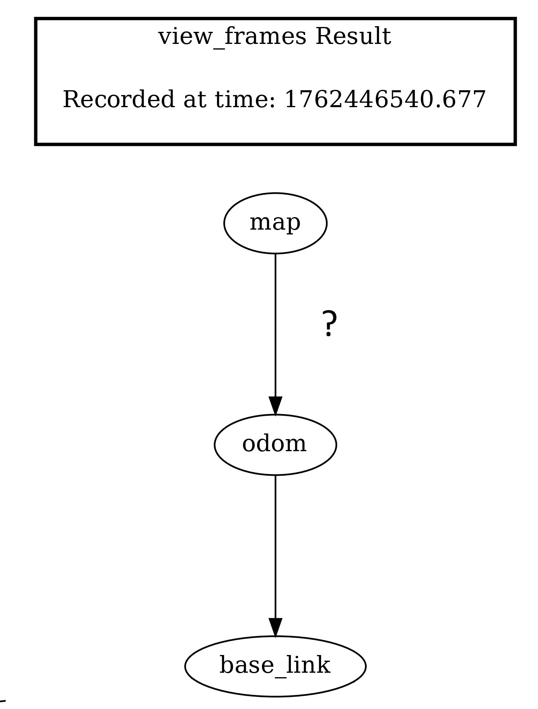
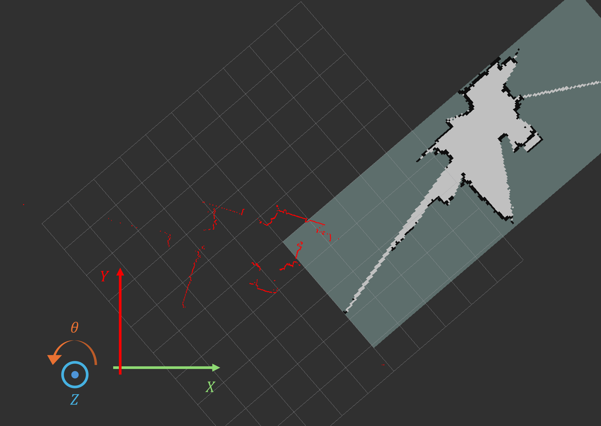
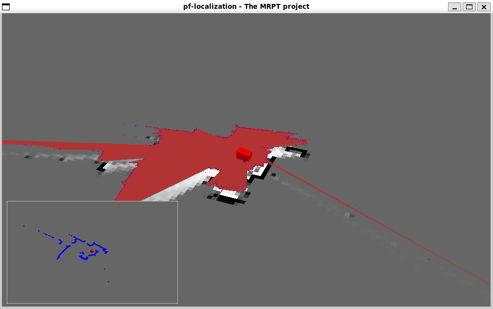
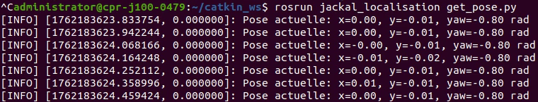

# jackal_localisation
**Localization pipeline for the Clearpath Jackal mobile robot using ICP**

This package implements the **localization pipeline** for the Clearpath **Jackal** robot using the **Iterative Closest Point (ICP)** algorithm.  
The goal is to estimate the robot pose in a **pre-existing map**, independently of the mapping process.

---

## Prerequisites

Before launching the localization pipeline, ensure that:

- A map has already been generated and saved (using `jackal_mapping`)  
- The map server is running and publishing the map  
- LiDAR data is available and properly configured  

---

## Overview

The localization approach relies on **scan-to-map registration**, where incoming LiDAR scans are aligned with a reference map using ICP.  
Unlike SLAM, the map is assumed to be fixed, and only the robot pose is estimated.

This method is particularly suitable for:

- Map-based navigation  
- Relocalization in known environments  
- Evaluation of odometry drift  

---

## ICP Algorithm

The **Iterative Closest Point** algorithm iteratively refines the rigid transformation between two point sets by:

- Establishing point correspondences  
- Minimizing a distance metric (typically point-to-point or point-to-plane)  
- Updating the estimated pose until convergence  

Performance is evaluated using metrics such as **Root Mean Square Error (RMSE)** and convergence stability.

---

## Map Server

First, ensure your workspace is built with:

```bash
cd ~/turtlebot_ws

source install/setup.bash

colcon build
```

Then, load the previously saved map using the ROS map server:

```bash
rosrun map_server map_server /home/your_folder/my_map.yaml
```

Replace the path with the location of your saved map file.

### LiDAR Preprocessing

If your system uses a 3D LiDAR, the point cloud must be projected into a 2D laser scan.
Run the conversion script located in `~catkin_ws/src/jackal_localisation/scripts/`:

```bash
rosrun jackal_localisation pointcloud_to_laserscan
```

This node converts the incoming 3D point cloud into a 2D LaserScan message suitable for ICP-based registration.

### Launch ICP Localization

Once the map and laser scan are available, start the ICP localization node using the provided launch file:

On another terminal:

```bash
roslaunch jackal_localisation icp_localisation.launch
```

This launch file:

- *subscribes to the laser scan topic*

- *performs scan-to-map ICP registration*

- *estimates the robot pose in the map frame*

- *publishes the updated pose for navigation and visualization*

## Visualization

To visualize the localization results, launch RViz:

On another treminal:

```bash
rviz
```

In RViz, make sure to enable:

- *the map display*

- *the laser scan*

- *the robot model*

- *the estimated pose (TF / Odometry)*

This allows real-time monitoring of ICP convergence and localization quality.

## Results

Once a map has been saved, an autonomous localization system is required to estimate the robot pose within the known environment.
Initially, no transformation exists between the robot and the map frame; ICP computes the pose `(x, y, θ)` relative to the map origin.



*Initial situation: no direct transformation between the robot and the map frame.*

Localization is performed using an **Iterative Closest Point (ICP)** algorithm, which aligns incoming 2D LiDAR scans with the existing map by iteratively minimizing the geometric error through translation and rotation. Unlike **AMCL**, the standard ROS localization method based on particle filtering and probabilistic state estimation, ICP performs direct geometric registration between sensor data and the map.



*Visual representation of translation and rotation between the map and the pointcloud*

Once the data is aligned, the robot pose can be reliably estimated at each scan. Localization is launched using the `icp_slam_jackal.launch` file, subscribing to `/obstacle_scan`, `map`, `odom`, and `base_link` frames to ensure consistent pose estimation.



*Visual feedback provided by `mrpt_icp_slam_2d`*

A debugging script, `get_pose.py`, can be used to retrieve the robot pose in real time. This node subscribes to `/robot_pose` (`PoseStamped`) published by `mrpt_icp_slam_2d` and converts quaternion orientations to Euler angles using `tf.transformations`.



*Terminal output of the robot pose retrieved from the `/robot_pose` topic.*

This pose retrieval method is reused in later stages of the project, particularly for autonomous navigation and closed-loop control.

*A video demonstrating the ICP process is available here:*

[](https://youtu.be/DLDB4zb0aGE?si=Yck3G630AOaFsLEl)


## Notes

ICP requires a reasonable initial pose estimate to converge correctly. Moreover, localization accuracy depends on map quality and environmental geometry. Dynamic obstacles may degrade registration performance

These limitations motivate future integration of semantic perception or probabilistic state estimation methods.

## References and Sources

### Tutorials and Documentation
- Open3D ICP Registration Tutorial  
  https://www.open3d.org/docs/0.12.0/tutorial/pipelines/icp_registration.html  
- Iterative Closest Point Explained (LearnOpenCV)  
  https://learnopencv.com/iterative-closest-point-icp-explained/

### Scientific Literature
- Bai, H., *ICP Algorithm: Theory, Practice and Its SLAM-Oriented Taxonomy*, 2022  
  https://arxiv.org/pdf/2206.06435v1  
- *MASt3R-SLAM: Real-Time Dense SLAM*  
  https://learnopencv.com/mast3r-slam-realtime-dense-slam-explained/

### ROS Resources
- MRPT ICP SLAM 2D  
  https://wiki.ros.org/mrpt_icp_slam_2d
